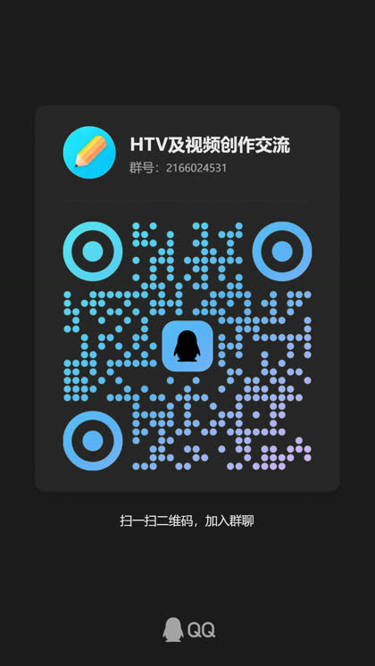
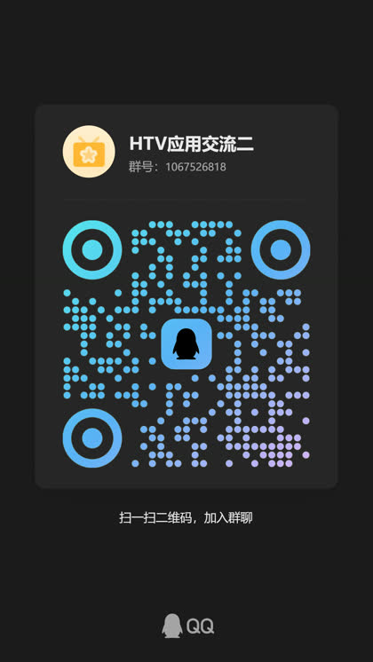

<div align="center">

# HTV · 手机电视直播

**免费 · 无广告 · 开箱即用 —— 手机与 Android 电视盒子通用的网络电视直播软件**

[](https://github.com/HTWMedia/HTV/releases/latest)
[](https://github.com/HTWMedia/HTV/releases/latest)
[](https://github.com/HTWMedia/HTV/releases/latest)
[](https://github.com/HTWMedia/HTV)
[](https://github.com/HTWMedia/HTV/blob/main/LICENSE)

[立即下载](https://github.com/HTWMedia/HTV/releases/latest) · [官方主页](https://htwmedia.dpdns.org/Home/Download) · [使用说明](#-使用说明) · [常见问题](#-常见问题) · [加入社区](#-加入社区) · [English](#english)

</div>

---


---

## 软件简介

HTV 是一款面向 Android 手机、电视与电视盒子的直播播放软件。内置央视、卫视、地方台、凤凰卫视等常用频道，直播源每天自动更新；播放异常时会自行尝试下一个可用源，不需要手动折腾。界面针对遥控器与触屏分别做了适配，电视上用方向键就能换台，手机上滑动即可。

- 免费使用，无需账号，打开即看
- 一套安装包同时适配手机与电视盒子
- 直播源持续维护，日常观看省心

> **与 TVBox 类工具有什么不同？**
> TVBox 之类的是「播放器空壳」，装完还要自己去找订阅源、自己维护地址，源挂了就得自己再找。
> HTV 是**开箱即用**的：内置央视、卫视、地方台等常用频道，源由服务端每天自动采集、逐条连通性体检、
> 按健康度排序下发，装完打开就能看，不需要你自己找任何东西。

## English

HTV is a free live-TV app for Android phones, TVs and TV boxes. It comes with daily-updated live sources covering CCTV, provincial satellite and local channels. When a stream fails, it automatically switches to the next available source — no manual fiddling. Highlights: favorite channels, catch-up TV (where supported by the source), EPG program guide, full remote-control navigation, IPv4/IPv6 support.

- Free, no account required, works out of the box
- One APK for both phones and TV boxes
- Download: [Latest Release](https://github.com/HTWMedia/HTV/releases/latest) · Homepage: [htwmedia.dpdns.org](https://htwmedia.dpdns.org/Home/Download)

## 加入社区

装完就想知道「源怎么又没了」「下个版本什么时候发」——这里有答案：

| 渠道 | 适合什么 | 入口 |
| --- | --- | --- |
| **QQ 交流群** | 即时交流、反馈失效频道、问用法 | 一群 **2166024531** / 二群 **1067526818**（任选其一，扫码见下） |
| **GitHub Discussions** | 反馈失效源、提建议、查历史问题（可检索、会被搜索引擎收录） | [进入 Discussions](https://github.com/HTWMedia/HTV/discussions) |
| **Watch 仓库** | 不发 QQ 也想收到发版通知：点仓库右上角 Watch → Custom → Releases | [HTWMedia/HTV](https://github.com/HTWMedia/HTV) |

<p>
  
  
</p>

- 一群「HTV及视频创作交流」：2166024531
- 二群「HTV应用交流二」：1067526818
- 任选其一加入即可，一群人满请进二群；App 内「设置 → 社区与反馈」也可以扫码

<!-- 社区二维码：qq-group1.jpg / qq-group2.jpg；如更换群请同步更新本注释、上方表格与 FAQ 中的群号 -->

**反馈失效频道请按这个格式写**（我这边能直接进自动体检队列，比「某某台看不了了」快得多）：

```
频道名：CCTV-5
现象：黑屏 / 一直转圈 / 卡住不动 / 提示播放失败
所在地区 + 网络：山东 · 联通宽带
App 版本：v6.0.0
```

## 功能特性

| 功能 | 说明 |
| --- | --- |
| 电视频道 | 内置央视、卫视、地方台、凤凰卫视等频道，直播源每天自动更新 |
| 自动换源 | 播放异常或长时间不出画面时，自动尝试下一个可用源，无需手动干预 |
| 频道收藏 | 频道列表中长按 OK 键即可收藏或取消收藏，收藏的频道集中在列表顶部「收藏」行 |
| 直播回放 | 支持回看最近播过的节目（需直播源支持），可在「设置 → 回看诊断」中查看与诊断 |
| 节目单 EPG | 节目信息自动加载，随时了解正在播什么、接下来播什么 |
| 布局切换 | 面板底部可切换横向分组 / 竖向列表；多源频道可在信息面板中手动切换播放源 |
| 全遥控操作 | 方向键、数字键、OK 键、菜单键均可操作，同时支持手机触屏手势 |
| 网络兼容 | 支持 IPv4 与 IPv6 网络环境，Android 4.4 及以上设备均可安装 |

## 下载与安装

1. 前往 [Releases](https://github.com/HTWMedia/HTV/releases/latest) 下载最新版本的 APK，也可从 [官方主页](https://htwmedia.dpdns.org/Home/Download) 获取
2. 手机直接点击安装；电视 / 盒子可通过 U 盘、文件管理器或 ADB 安装
3. 首次安装如提示「未知来源」，允许一次即可
4. 打开即可观看，无需额外配置

> 建议把 App 加入电视 / 盒子的开机自启动或桌面快捷方式，使用更顺手。

## 使用说明

### 电视 / 盒子（遥控器）

- **换台**：上下方向键 / 数字键，或在屏幕上上下滑动
- **选台**：OK 键 / 单击屏幕
- **收藏**：频道列表中长按 OK 键，收藏或取消收藏
- **回看**：设置 → 回看诊断，可回看最近播过的节目
- **设置**：菜单键 / 帮助键 / 长按 OK 键 / 长按屏幕
- **分组与换源**：面板底部切换横向分组 / 竖向列表；多源频道在信息面板中切换播放源

### 手机（触屏）

- **换台**：屏幕上下滑动
- **选台**：单击屏幕
- **设置**：长按屏幕

## 常见问题

**一直加载、不出画面怎么办？**

App 会在起播超时后自动尝试下一个可用源。若整个频道列表加载失败，界面会给出状态提示，按 OK 键即可重试。

**某个频道看不了、是不是源挂了？**

先在信息面板里手动切一个源（「源 X/Y」）试试。如果整个频道都不行，基本可以断定这条源失效了——
请到 [Discussions](https://github.com/HTWMedia/HTV/discussions) 按[上面的格式](#-加入社区)反馈，
或进 QQ 群（一群 **2166024531** / 二群 **1067526818**）说一声。报过来的频道会进自动体检队列，下一轮更新自动摘除死源、补上新源。

**回看功能用不了？**

直播回放依赖直播源本身是否提供回看能力，可在「设置 → 回看诊断」中确认当前源的支持情况。

**节目单显示有延迟？**

节目信息（EPG）为异步加载，稍等片刻即可，不影响正常观看。

**支持自己添加直播源吗？**

支持定制自定义源，有需要可直接联系作者。

## 更新记录

- **v6.0.0**：新增频道收藏、直播回放（回看）；优化起播策略与自动换源逻辑；加载失败增加状态提示与一键重试；界面与稳定性多项优化

完整历史版本见 [Releases](https://github.com/HTWMedia/HTV/releases)。

## 支持作者

HTV 免费、无广告、**不设付费墙**——所有功能对所有人都一样开放，不存在「付费才能看」的频道。

开发创作不易，如果你觉得它确实节省了你的时间，欢迎**自愿赞赏**，金额随意，纯属鼓励：

<p>


</p>

> 赞赏是**无对价的赠与**，不构成交易，也不会解锁任何功能或内容。

**需要定制服务？** 私有直播源搭建、企业内部频道接入、播放器内核定制等属于有实际交付的技术服务，
欢迎在 [Discussions](https://github.com/HTWMedia/HTV/discussions) 或 QQ 群联系作者。

## 致谢

[my_tv](https://github.com/yaoxieyoulei/my_tv "my_tv")

---

**关键词**：IPTV · 电视直播 · 手机电视 · 网络电视 · 直播源 · 电视盒子 · Android TV · 直播回放 · EPG 节目单 · 央视卫视
