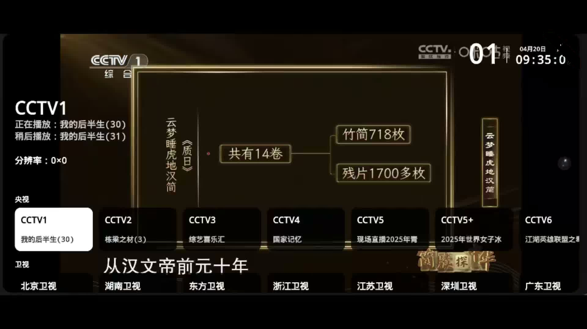

# HTV
A live media player app（手机、电视直播软件）

app可在右侧release中下载，免费使用，如需定制自定义源可联系作者。

## 使用

Android系统的手机或电视上

### 电视遥控器
+ 换台：上下方向键 / 数字键，或屏幕上下滑动
+ 选台：OK键 / 单击屏幕
+ 收藏：频道列表中长按OK键收藏或取消收藏，收藏的频道集中在列表顶部「收藏」行
+ 回看：设置 → 回看诊断，可回看最近播过的节目（需直播源支持）
+ 设置：菜单键 / 帮助键 / 长按OK键 / 长按屏幕
+ 面板底部可切换横向分组 / 竖向列表；多源频道可在信息面板中切换播放源

### 手机
+ 换台：屏幕上下滑动
+ 选台：单击屏幕
+ 设置：长按屏幕

## 说明

+ 支持Android 4.4 及以上，网络环境IPv4或IPv6均可
+ 内置央视、卫视及凤凰卫视等稳定直播源，每天自动更新
+ 播放异常或长时间不出画面时，自动尝试切换下一个可用源
+ 直播源加载失败时会有状态提示，按OK键即可重试
+ 节目信息EPG异步加载，可能稍有延迟

## 声明

开发创作不易，如果您觉得有用或者节省了您宝贵的时间，请给作者小小赞下吧，3Q：

## 致谢
[my_tv](https://github.com/yaoxieyoulei/my_tv "my_tv")
